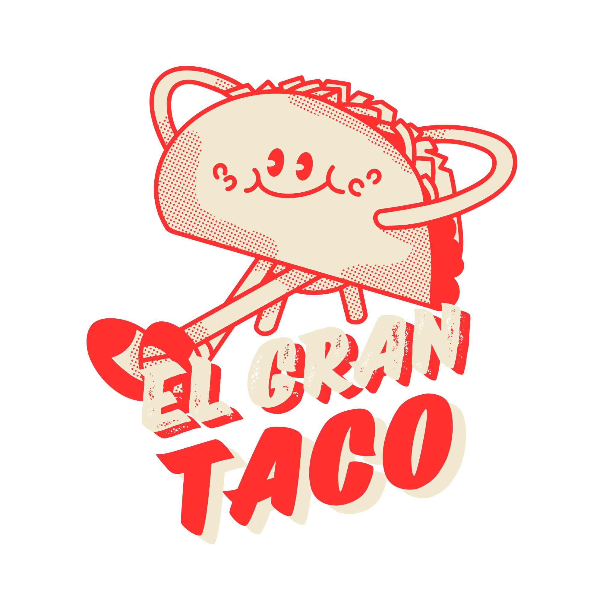
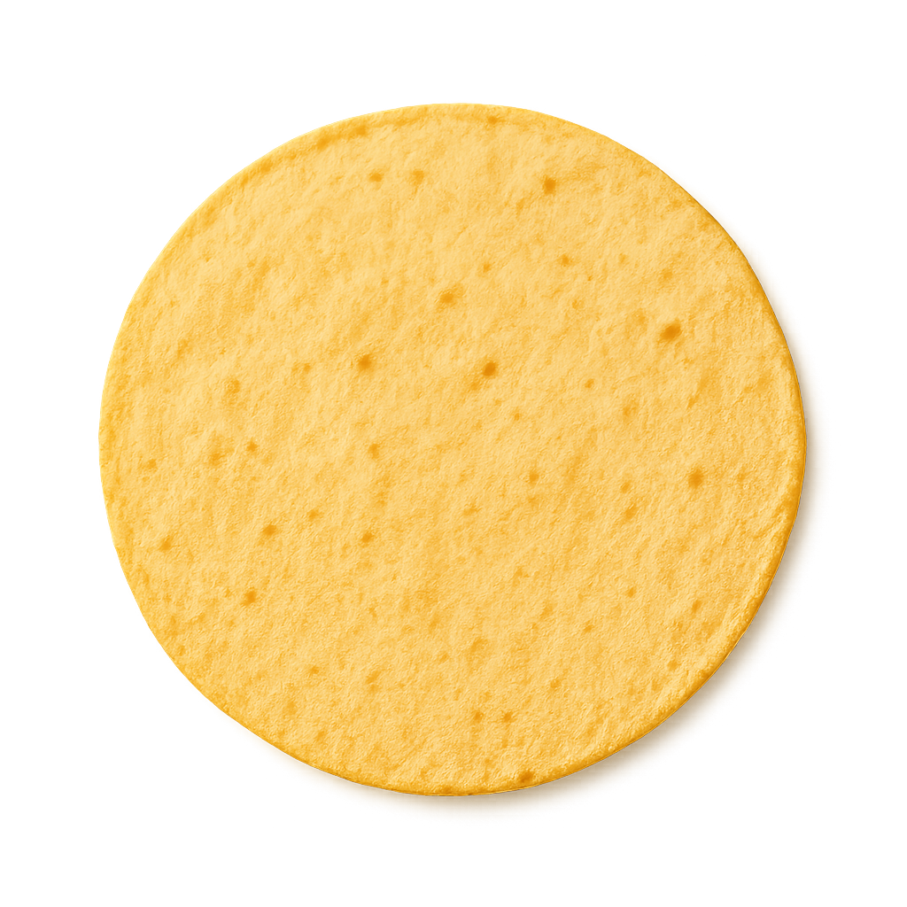
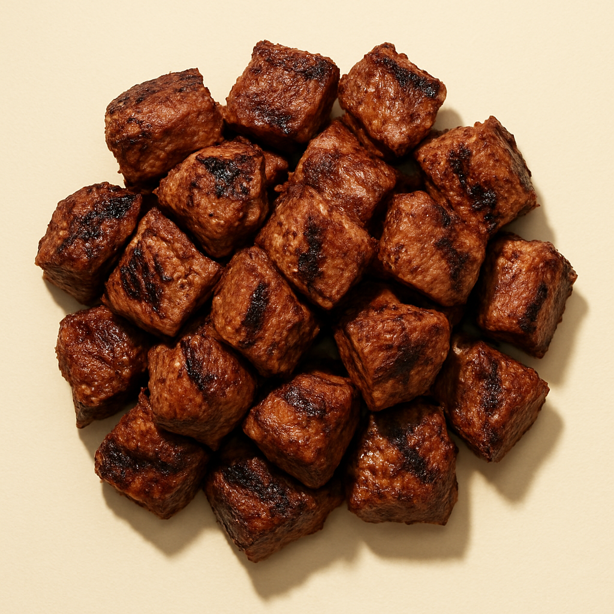
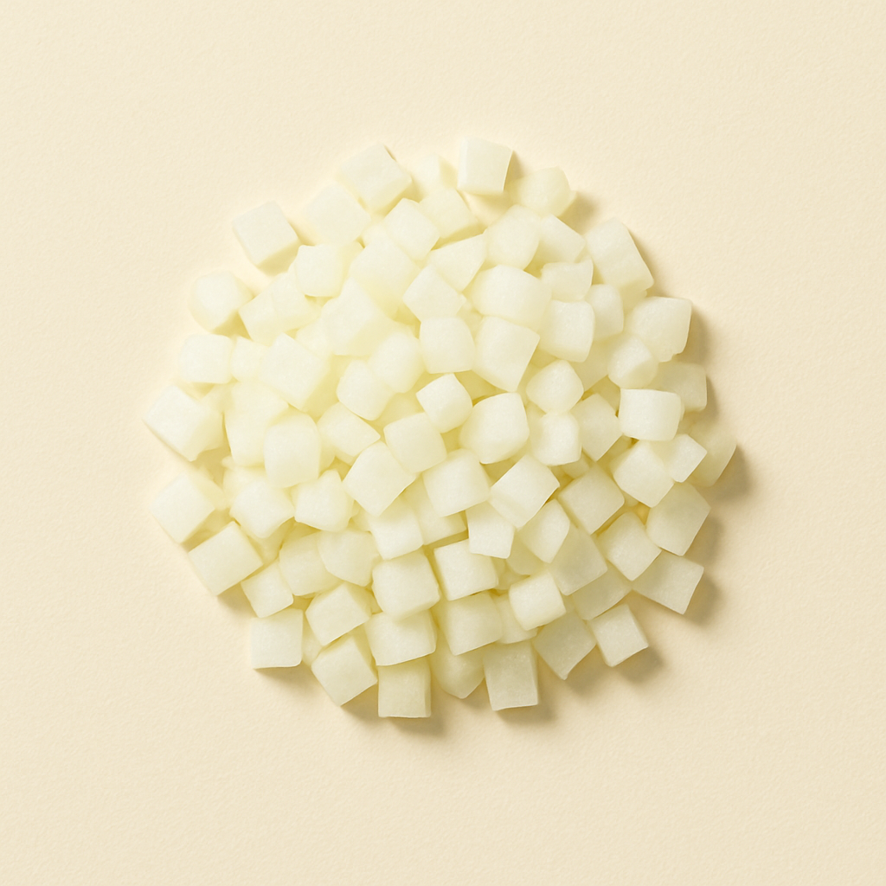
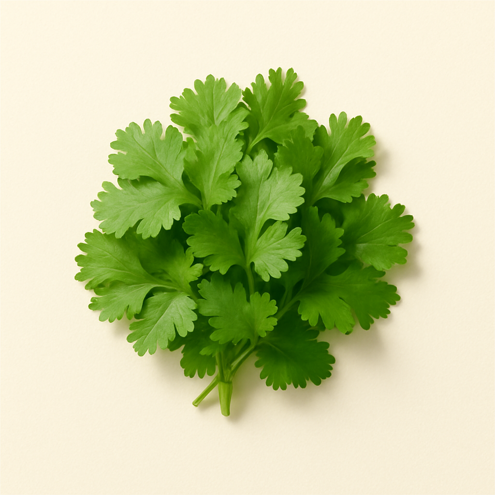
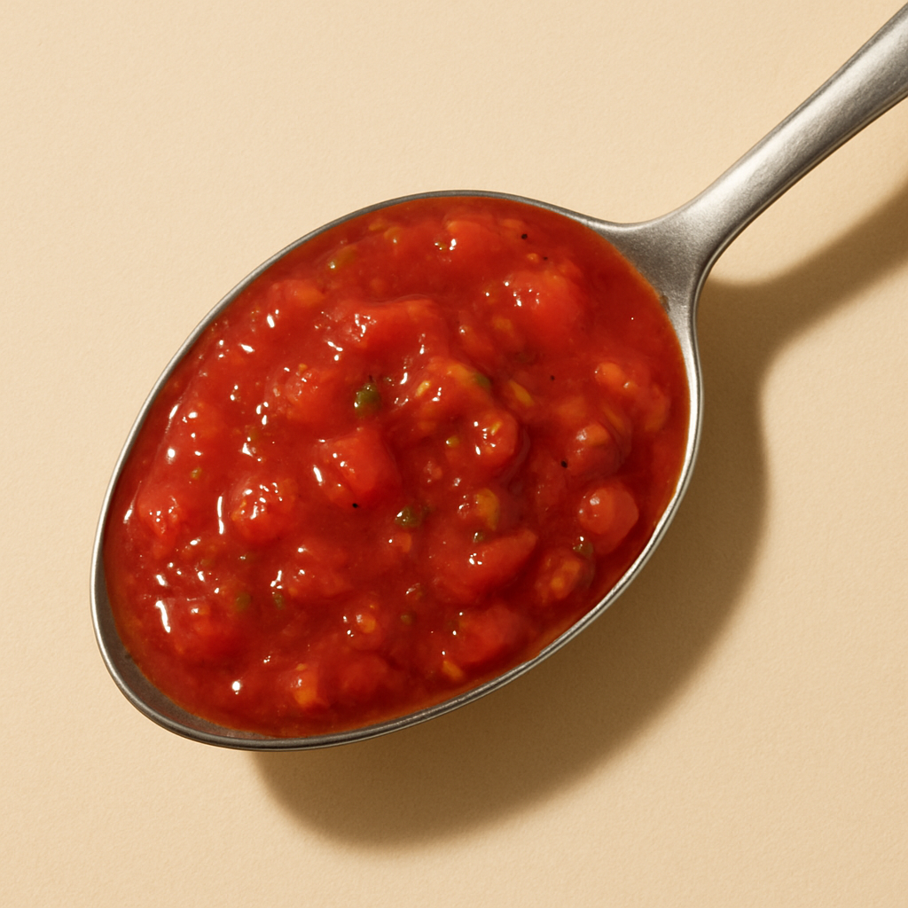
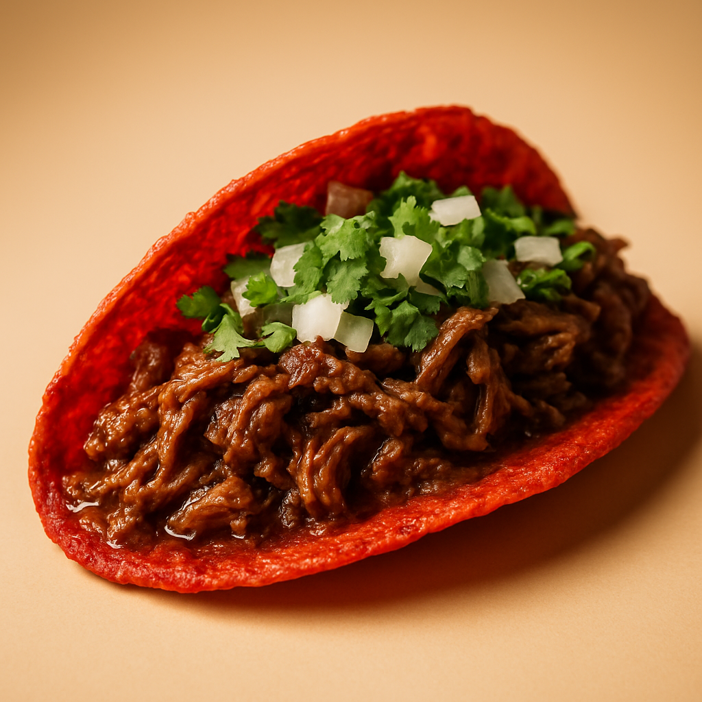
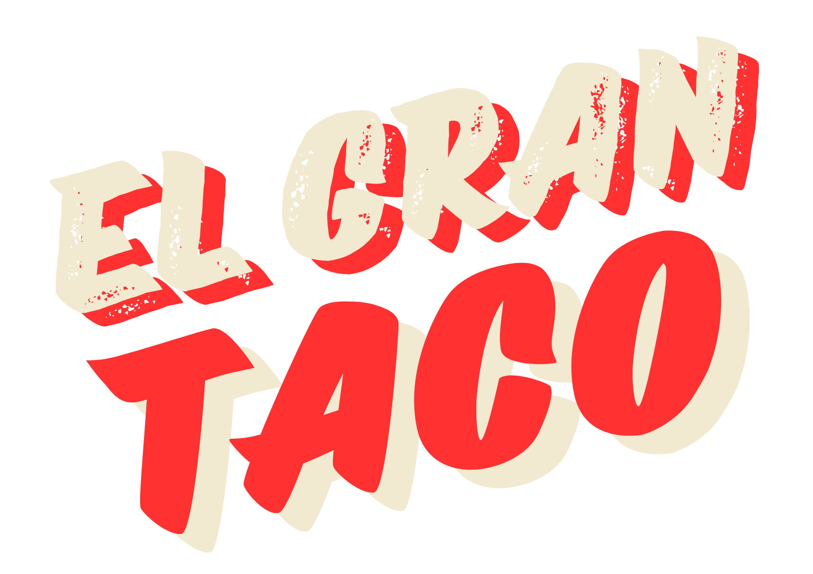

<div align="center">
  
  <br/><br/>

  <h1>El Gran Taco</h1>
  <p><strong>Taquería mexicana moderna · Single-page marketing site</strong></p>

  <p>
    
    
    
    
    
    
  </p>
</div>

---

## El proyecto

Landing page de alto rendimiento para **El Gran Taco**, una taquería mexicana moderna de autor. El objetivo era demostrar que una marca de restauración puede tener una presencia digital al nivel de marcas premium internacionales: scroll storytelling cinematográfico, animaciones GPU-aceleradas y una identidad gráfica coherente de principio a fin.

> "Sabor de calle, alma de autor."

---

## Stack tecnológico

| Tecnología | Versión | Rol |
|---|---|---|
| [Next.js](https://nextjs.org) | 16.2 (App Router) | Framework, SSG, optimización de imágenes |
| [React](https://react.dev) | 19 | UI, hooks, client components |
| [TypeScript](https://www.typescriptlang.org) | 5.7 | Tipado estático en todo el proyecto |
| [Tailwind CSS](https://tailwindcss.com) | v4 | Estilos utility-first, design tokens via `@theme inline` |
| [Motion](https://motion.dev) | 12 | Todas las animaciones — `useScroll`, `useTransform`, `motion/react` |
| [Lenis](https://lenis.darkroom.engineering) | 1.3 | Smooth scroll global |
| [gifuct-js](https://github.com/matt-way/gifuct-js) | 2.1 | Decodificación de GIF frame a frame para el Hero |
| [shadcn/ui](https://ui.shadcn.com) | 4 | Primitivas UI base |
| [pnpm](https://pnpm.io) | 9.15 | Package manager |
| [Dokploy](https://dokploy.com) | — | Self-hosted deployment (Docker + `output: standalone`) |

---

## Identidad gráfica

### Paleta de colores

Cuatro tokens definen toda la paleta. Declarados como variables CSS nativas y mapeados como utilidades Tailwind:

| | Token | Hex | Tailwind | Uso |
|:---:|---|---|---|---|
|  | `--cream` | `#f1ead0` | `bg-cream` / `text-cream` | Fondo de página, texto sobre oscuro |
|  | `--ink` | `#1a1310` | `bg-ink` / `text-ink` | Secciones oscuras, tipografía principal |
|  | `--red` | `#ff3131` | `bg-red` / `text-red` | CTAs, logo, acentos primarios |
|  | `--pink` | `#ff8e8e` | `bg-pink` / `text-pink` | Glows, acentos secundarios |

```css
/* app/globals.css */
:root {
  --cream: #f1ead0;
  --ink:   #1a1310;
  --red:   #ff3131;
  --pink:  #ff8e8e;
}
```

### Tipografía

Tres familias con roles intencionalmente separados:

| Variable CSS | Fuente | Origen | Uso |
|---|---|---|---|
| `--font-display` | **KG Cold Coffee** | TTF local (`assets/`) | Headlines, títulos de sección, nombres de productos — el alma de la marca |
| `--font-sans` | **Outfit** | Google Fonts | Cuerpo de texto, navegación, etiquetas, UI |
| `--font-mono` | **Geist Mono** | Google Fonts | Stats numéricos, horarios, datos |

La fuente display `KG Cold Coffee` es una tipografía de pizarra manuscrita que da carácter artesanal y cálido a todos los titulares. Se carga como fuente local en `app/layout.tsx`:

```tsx
const kgColdCoffee = localFont({
  src: '../assets/KGColdCoffee.ttf',
  variable: '--font-display',
  display: 'swap',
})
```

---

## El taco que se arma solo

La animación más característica del proyecto: **cinco ingredientes que vuelan desde posiciones dispersas en pantalla y se ensamblan en un taco perfecto** mientras el usuario hace scroll.

### Proceso de creación del GIF del Hero

El taco animado en la pantalla de inicio no es un vídeo convencional. Fue creado siguiendo este flujo:

```
Grabación/diseño del taco girando
        ↓
   Google Flow
 (edición de vídeo + composición)
        ↓
  Exportar con fondo transparente
        ↓
  Convertir a GIF (fondo transparente)
        ↓
  Decodificar frame a frame con gifuct-js
        ↓
  Pintar en <canvas> sincronizado con scrollYProgress
```

El resultado: el GIF **no se auto-reproduce**. Cada frame se pinta manualmente en un `<canvas>` usando `requestAnimationFrame`, y la posición del scroll determina qué frame se muestra. El usuario "controla" la animación con su scroll.

### Taco explotado → Taco ensamblado

El componente `TacoAssembly` replica esta misma idea con CSS/Motion puro, sin GIF:

<table>
<tr>
<td width="50%" align="center">
<br/>
<strong>① Ingredientes dispersos</strong><br/>
<em>Estado inicial — cada capa parte de una posición aleatoria fuera de la vista</em>
<br/><br/>





<br/><br/>
</td>
<td width="50%" align="center">
<br/>
<strong>② Taco ensamblado</strong><br/>
<em>Estado final — todas las capas apiladas en su posición correcta</em>
<br/><br/>

<br/><br/>
</td>
</tr>
</table>

Las 5 capas son: `Tortilla de maíz → Carne asada → Cebolla fresca → Cilantro → Salsa de la casa`.

### Cómo funciona técnicamente

La sección tiene `320vh` de alto. El viewport queda anclado (`sticky top-0 h-screen`) y `scrollYProgress` va de `0` a `1` mientras el usuario desplaza esos `320vh`. Cada capa se activa en su propio **slice** proporcional del scroll:

```tsx
// components/taco-assembly.tsx

const layers: Layer[] = [
  { src: tortillaImg, fromX: -420, fromY:  220, fromR: -35, toY:  70 },
  { src: carneImg,    fromX:  420, fromY:  120, fromR:  30, toY:  18 },
  { src: onionImg,    fromX: -360, fromY: -180, fromR: -25, toY: -18 },
  { src: cilantroImg, fromX:  380, fromY: -240, fromR:  28, toY: -44 },
  { src: salsaImg,    fromX:    0, fromY: -340, fromR:  18, toY: -64 },
]

// Cada ingrediente tiene su propio slice del scroll total
const start  = 0.12 + (index / total) * 0.55
const end    = start + 0.28

const x      = useTransform(scrollYProgress, [start, end], [layer.fromX, 0])
const y      = useTransform(scrollYProgress, [start, end], [layer.fromY, layer.toY])
const rotate = useTransform(scrollYProgress, [start, end], [layer.fromR, 0])
const opacity = useTransform(scrollYProgress, [start, start + 0.06], [0, 1])
```

---

## Sistema de animaciones

Todas las animaciones usan **Motion** (`motion/react`). No hay `@keyframes` CSS para nada complejo — todo son transforms GPU-acelerados.

### Tipos de animación usados

| Tipo | Técnica | Dónde |
|---|---|---|
| **GIF Scrubber** | Canvas API + `gifuct-js` + `scrollYProgress` → frame index | `Hero` |
| **Scroll-pinned** | Contenedor `h-[Nvh]` + `sticky top-0` + `useScroll` | `Hero`, `TacoAssembly` |
| **Parallax horizontal** | `useTransform(scrollY, [0,1], ['0%','-66%'])` sobre un track de `w-max` | `IngredientsParallax` |
| **Char/Word split** | Stagger de caracteres o palabras en `whileInView` | `SplitText` (reutilizable) |
| **Entrance** | `initial → whileInView` con `viewport: { once: true }` | Todos los bloques de texto |
| **Acordeón hover** | `flex-grow` CSS transition + `useState` para índice activo | `SnacksSection` |
| **Float infinito** | `animate` con `keyframes` + `repeat: Infinity` | Cards de tacos |
| **Glassmorphism reactivo** | `useMotionValueEvent` → `backgroundColor` + `backdropFilter` | `Navbar` |
| **Entrada de chars** | `SplitText mode="chars"` con stagger `0.04s` por carácter | Headline del Hero |

### GIF Scrubber — la técnica más singular

```tsx
// hero.tsx — flujo completo simplificado
useEffect(() => {
  const { parseGIF, decompressFrames } = await import('gifuct-js') // lazy import
  const res    = await fetch('/taco-gif-remove-background.gif')
  const frames = decompressFrames(parseGIF(await res.arrayBuffer()), true)

  // Pre-renderizar todos los frames como ImageBitmap para máximo rendimiento
  const bitmaps = await Promise.all(
    frames.map(frame => createImageBitmap(new ImageData(frame.patch, ...)))
  )

  // rAF loop — pinta el frame que corresponde al progreso actual
  const tick = () => {
    const idx = Math.floor(scrollYProgress.get() * bitmaps.length)
    ctx.drawImage(bitmaps[idx], 0, 0)
    rafId = requestAnimationFrame(tick)
  }
  rafId = requestAnimationFrame(tick)
}, [])
```

### Parallax horizontal de ingredientes

```tsx
// ingredients-parallax.tsx
const { scrollYProgress } = useScroll({ target: ref, offset: ['start start', 'end end'] })
const x = useTransform(scrollYProgress, [0, 1], ['0%', '-66%'])

// El track tiene w-max y se desliza de 0% a -66% a lo largo de 300vh
<motion.div style={{ x }} className="flex w-max gap-12">
  {products.map(p => <ProductCard key={p.name} prod={p} />)}
</motion.div>
```

### SplitText — headlines animados reutilizables

```tsx
// Uso en cualquier componente
<SplitText
  as="h2"
  text="Cinco piezas. Un taco perfecto."
  mode="words"      // 'chars' | 'words'
  inView            // true = dispara en viewport, false = al montar
  stagger={0.08}    // segundos entre cada palabra/carácter
  className="font-display text-5xl text-ink"
/>
```

### Acordeón hover en Snacks

```tsx
// snacks-section.tsx
const [active, setActive] = useState(1) // Nachos arranca expandido

<div onMouseLeave={() => setActive(DEFAULT_WIDE)}>
  {snacks.map((snack, i) => (
    <motion.div
      onMouseEnter={() => setActive(i)}
      style={{
        flexGrow: active === i ? 2 : 1,
        transition: 'flex-grow 0.55s cubic-bezier(0.4, 0, 0.2, 1)',
      }}
    />
  ))}
</div>
```

### Accesibilidad — Reduced Motion

Cada componente con animación verifica `useReducedMotion()` y elimina los transforms si el usuario lo prefiere:

```tsx
const reduce = useReducedMotion()

<motion.div
  style={{
    x:      reduce ? 0 : x,
    rotate: reduce ? 0 : rotate,
    y:      reduce ? layer.toY : y,
  }}
/>
```

---

## Arquitectura de componentes

```
app/
├── layout.tsx            ← Fuentes, metadata, Analytics condicional
├── page.tsx              ← Composición lineal de todas las secciones
├── globals.css           ← Tokens de color, @theme inline, Tailwind v4
├── icon.png              ← Favicon (App Router convention — sin config manual)
└── apple-icon.png        ← Icono iOS home screen

components/
├── smooth-scroll.tsx     ← Lenis global (monta en layout, renderiza null)
├── navbar.tsx            ← Fija, glassmorphism reactivo al scroll, menú móvil
├── scroll-to-top.tsx     ← Botón flotante animado
├── hero.tsx              ← GIF scrubber + SplitText + stats + scroll hint
├── marquee.tsx           ← Banda de texto infinito animada
├── split-showcase.tsx    ← Dos secciones foto/texto a pantalla completa
├── tacos-section.tsx     ← Cards flotantes con selección y spice indicator
├── taco-assembly.tsx     ← Scroll-pinned — 5 capas de ingredientes
├── snacks-section.tsx    ← Grid acordeón con hover expandible
├── ingredients-parallax.tsx ← Carrusel parallax horizontal + logo reveal
├── locales-section.tsx   ← Cards tipo Polaroid con rotación aleatoria
├── testimonials.tsx      ← Grid de reseñas de clientes
├── final-cta.tsx         ← CTA a pantalla completa con imagen de fondo
├── footer.tsx            ← Links, redes sociales, horarios
├── split-text.tsx        ← Componente animado reutilizable
└── ui/
    └── button.tsx        ← Primitiva shadcn/ui

assets/                   ← Todas las imágenes como static imports ES module
│   KGColdCoffee.ttf
│   el-gran-taco-logotipo.png
│   el-gran-taco-letters.png
│   footer-logotype.png
│   cta-tacos.png / hero-tacos.png
│   taco-pastor.png / taco-carnitas.png / taco-birria.png / tinga-de-pollo.png
│   ing-tortilla.png / ing-carne.png / ing-onion.png / ing-cilantro.png / ing-salsa.png
│   nachos-tacos.webp / patatas-tacos.webp / quesadilla-tacos.webp / tequenos-tacos.webp
│   madrid-tacos.webp / murcia-tacos.webp / benidorm-tacos.webp
│   cilantro-el-gran-taco.webp / cebollas-el-gran-taco.webp / piña-el-gran-taco.webp
│   aguacate-el-gran-taco.webp / chiles-el-gran-taco.webp / lima-el-gran-taco.webp

public/
└── taco-gif-remove-background.gif  ← Único archivo en public/ (se obtiene con fetch())
```

> **¿Por qué hay un archivo en `public/` y el resto en `assets/`?**
> El GIF del Hero se descarga con `fetch()` en tiempo de ejecución para decodificarlo frame a frame con `gifuct-js`. Los `import` estáticos de Next.js no devuelven el binario necesario para esa operación, así que este archivo vive en `public/` para poder acceder a él por URL.

---

## Patrones de código destacados

### Static imports para todas las imágenes

En lugar de strings (`src="/foto.png"`), todas las imágenes se importan como módulos ES. Esto proporciona tipado `StaticImageData`, hash de nombres para cache-busting automático en producción y verificación en tiempo de compilación de que el archivo existe:

```tsx
import logotipoImg from '../assets/el-gran-taco-logotipo.png'
import madridImg   from '../assets/madrid-tacos.webp'
// ↑ TypeScript conoce width, height y src del asset

<Image src={logotipoImg} alt="El Gran Taco" fill />
//          ↑ StaticImageData — no string
```

### Tokens de color como CSS variables

```tsx
// ✅ Correcto — usa los tokens del sistema
<div className="bg-ink text-cream">
  <span className="text-red">Taquería mexicana moderna</span>
</div>

// ❌ Incorrecto — valores hex directos
<div style={{ background: '#1a1310' }}>
```

---

## Secciones de la página

La página (`app/page.tsx`) compone las secciones en este orden:

| # | Componente | Descripción |
|---|---|---|
| 1 | `Hero` | GIF scrubber por scroll + headline animado por chars |
| 2 | `Marquee` | Banda de texto infinito de marca |
| 3 | `SplitShowcase` | Dos secciones foto/texto a pantalla completa |
| 4 | `TacosSection` | Menú de tacos con cards flotantes |
| 5 | `TacoAssembly` | Animación de montaje scroll-driven (dentro de TacosSection) |
| 6 | `SnacksSection` | Grid de snacks con acordeón hover |
| 7 | `IngredientsParallax` | Carrusel parallax horizontal de ingredientes |
| 8 | `LocalesSection` | Tarjetas de los 3 locales (Madrid, Murcia, Benidorm) |
| 9 | `Testimonials` | Reseñas de clientes |
| 10 | `FinalCTA` | Llamado a la acción a pantalla completa |
| 11 | `Footer` | Links, redes, horarios |

---

## Comandos

```bash
pnpm dev      # Servidor de desarrollo en http://localhost:3000 (Turbopack)
pnpm build    # Build de producción
pnpm lint     # ESLint
```

---

## Despliegue

```bash
# Build
pnpm build   # genera .next/standalone/

# Docker
docker build -t el-gran-taco .
docker run -p 3000:3000 el-gran-taco
```

El proyecto usa `output: 'standalone'` en `next.config.mjs` y tiene un `Dockerfile` incluido para despliegue self-hosted en [Dokploy](https://dokploy.com).

`@vercel/analytics` está instalado pero solo se renderiza en `process.env.NODE_ENV === 'production'`, manteniendo el bundle de desarrollo limpio.

---

<div align="center">
  
  <br/><br/>
  <sub>Diseñado y desarrollado con intención · El Gran Taco © 2025</sub>
</div>
